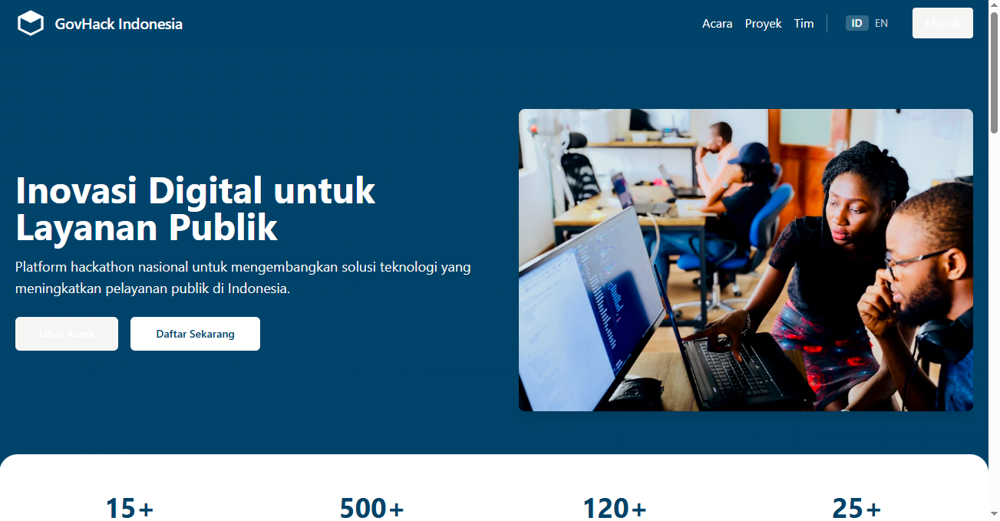

# GovHack Indonesia - Platform Hackathon Pemerintah

Platform hackathon dan kompetisi pengembangan aplikasi yang berfokus pada pemerintahan, bertujuan mendorong pengembang untuk menciptakan solusi digital bagi berbagai masalah pemerintah dan meningkatkan layanan publik.

## Logo



## Overview / Ikhtisar

GovHack Indonesia adalah platform komprehensif untuk memfasilitasi penyelenggaraan, partisipasi, dan manajemen hackathon yang berfokus pada solusi pemerintahan. Platform ini menjembatani komunitas pengembang, desainer, dan inovator dengan kementerian dan lembaga pemerintah untuk bersama-sama mengatasi tantangan publik melalui solusi teknologi.

## Fitur / Features

### Manajemen Acara / Event Management
- Pembuatan dan pengelolaan acara hackathon
- Jadwal pendaftaran dan pelaksanaan
- Pengelolaan peserta dan tim

### Kolaborasi Tim / Team Collaboration
- Pembentukan tim
- Komunikasi antar anggota tim
- Berbagi dokumen dan resource

### Pengajuan Proyek / Project Submissions
- Pengiriman dan pengelolaan proyek
- Integrasi dengan repositori kode (GitHub, GitLab)
- Pencatatan dan pelacakan progres

### Voting & Penilaian / Voting & Judging
- Sistem penilaian untuk juri
- Voting publik
- Leaderboard realtime

### Dukungan Dwibahasa / Bilingual Support
- Konten dalam Bahasa Indonesia
- Konten dalam Bahasa Inggris
- Kemampuan beralih bahasa dengan cepat

## Teknologi / Technologies

### Frontend
- React.js
- TanStack Query
- Tailwind CSS
- Shadcn UI
- i18next untuk internasionalisasi

### Backend
- Node.js
- Express
- In-memory storage (development)
- Drizzle ORM + PostgreSQL (production)

## Pengembangan / Development

### Prasyarat / Prerequisites
- Node.js (versi 16 atau lebih tinggi)
- npm atau yarn

### Instalasi / Installation
1. Clone repository
```
git clone https://github.com/yourusername/govhack-indonesia.git
cd govhack-indonesia
```

2. Instal dependensi
```
npm install
```

3. Jalankan dalam mode pengembangan
```
npm run dev
```

4. Buka browser di `http://localhost:5000`

## Struktur Proyek / Project Structure

```
├── client/                # Frontend React application
│   ├── src/
│   │   ├── components/    # Reusable UI components
│   │   ├── hooks/         # Custom React hooks
│   │   ├── lib/           # Utility functions
│   │   ├── pages/         # Page components
│   │   └── translations/  # i18n translation files
├── server/                # Backend Express application
│   ├── index.ts           # Server entry point
│   ├── routes.ts          # API endpoints
│   ├── storage.ts         # Data storage abstraction
│   └── vite.ts            # Vite configuration for development
├── shared/                # Shared code between front/back
│   └── schema.ts          # Data models and validation
```

## Kontribusi / Contributing

Kami menyambut kontribusi dari komunitas. Silakan baca petunjuk kontribusi kami untuk informasi tentang proses pengajuan pull request.

## Lisensi / License

Proyek ini dilisensikan di bawah MIT License - lihat file [LICENSE](LICENSE) untuk detail lebih lanjut.

## Kontak / Contact

habizinnia@gmail.com